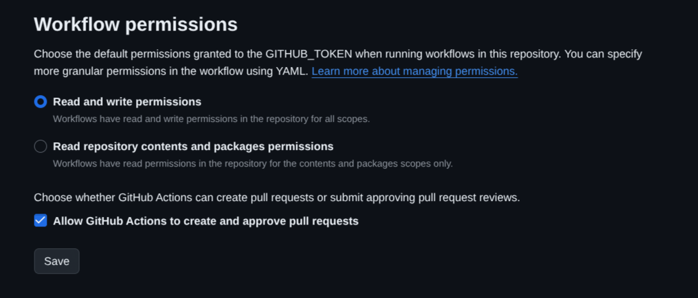

# Configurar GITHUB para poder crear imagenes de Docker en el repositorio.
Revisar los permisos generales de Actions en el Repositorio
A veces, las configuraciones de seguridad a nivel de cuenta o repositorio bloquean los permisos que intentas declarar en tu archivo .yml.

1. Entra en tu repositorio en GitHub.
2. Ve a Settings (Configuración) > Actions > General.
3. Haz scroll hacia abajo hasta encontrar la sección Workflow permissions.
4. Asegúrate de que está marcada la opción "Read and write permissions".
5. Asegúrate de que la casilla que dice "Allow GitHub Actions to create and approve pull requests" esté marcada (a veces GitHub agrupa políticas de escritura aquí).
6. Guarda los cambios.

